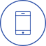

# EIT Icons

This README lists all the icons available in this repository.

| Icon Name | Icon |
|---|---|
| add_user |  |
| arrows_both_ways |  |
| atom |  |
| bar_chart |  |
| battery_charging |  |
| book |  |
| brainstorming_idea_exchange |  |
| cable |  |
| camera |  |
| chart |  |
| chart_globe |  |
| chart_presentation |  |
| chat |  |
| chat_symbol |  |
| clock |  |
| coin_and_shield |  |
| computer_monitor |  |
| computer_mouse |  |
| control_panel |  |
| currency_exchange |  |
| delete_user |  |
| direction_arrows_circle |  |
| drop |  |
| flag |  |
| flask |  |
| flowchart |  |
| folder |  |
| gear |  |
| gears |  |
| globe |  |
| graduation_cap |  |
| group_people |  |
| head_with_bolt |  |
| headphones |  |
| heart_health |  |
| hourglass |  |
| id_card |  |
| leaf |  |
| led |  |
| light_bulb |  |
| looping_arrows |  |
| mail |  |
| meeting |  |
| megaphone |  |
| mind_setting |  |
| mobile_phone |  |
| network |  |
| network_diagram |  |
| northwest_arrow |  |
| notebook_contact |  |
| notepad |  |
| people_arrow |  |
| people_connected |  |
| people_exchange |  |
| person_idea |  |
| power_button |  |
| presentation_chart |  |
| prize |  |
| recycling_symbol |  |
| refresh |  |
| satellite |  |
| satellite_dish |  |
| signal |  |
| social_group |  |
| target_bullseye |  |
| teamwork |  |
| thought_bubble |  |
| thought_bubble_person |  |
| thumbs_up |  |
| trophy_on_podium |  |
| user |  |
| user_globe |  |
| user_profile |  |
| user_search |  |
| video_play |  |
| wind_turbine |  |
